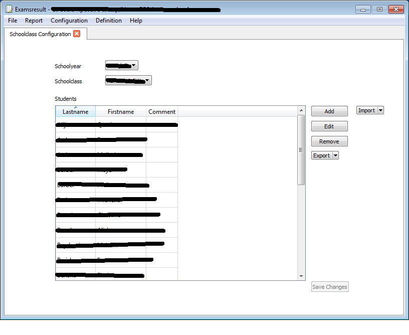

# Examsresult

This Application is a tool for Teacher to handle Exams and Test results 
of students and complete School Classes with several Subjects

Have every time a complete overview to Results of Students and complete School Classes


## Features
* set School Years
* set School Class Names
* define Subjects
* define Exam Types and weight them
* define Time Periods and weight them
* define School Class for School Year and assign Students
* handle several Subjects in every School Class
* handle mixed Classes with students of several School Classes
* import Students from CSV
* import Students from a Class of a School Year before
* assign a photo to a student
* handle an Exam for complete School Class or a single student
* CSV/PDF Export of School Class Student List
* CSV/PDF Export of Exams List of School Class
* CSV/PDF Export of Exam Results
* CSV/PDF Export of Student Results (in Timeperiod and complete Schoolyear)
* CSV/PDF Export of Schoolclass Results (in Timeperiod and complete Schoolyear)
* optional PDF Password Encryption
* calculates each Timeperiod seperate and show result
* select method how schoolyear final result will be calculated
* "Simulation" (what happens if Student has in next Test(s) this result(s)?)


**Configuration of a Schoolclass**




**List of Exams for a Subject in a Schoolclass**


**Results of an Exam**


## Install Instructions for Windows
1. Download an install at least Python 3.5 from https://www.python.org/downloads/
2. Download an install pip-win https://sites.google.com/site/pydatalog/python/pip-for-windows
3. open pip-win and paste in "command" this command and klick run:
 - pip install sqlalchemy pyqt5 reportlab requests
4. to open examsresult in Windows doubleclick "start.py"

## Problem on some Debian based Systems (Debian, Ubuntu, ...)
if receiving the following error **ModuleNotFoundError: No module named 'PyQt5.sip'**

ensure Package 'python3-pyqt5' is installed

### and use this script for running examsresult in future:

```
#!/bin/sh
export PYTHONPATH=/usr/lib/python3/dist-packages
examsresult
```

maybe export path differs

